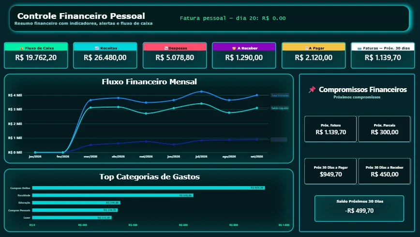
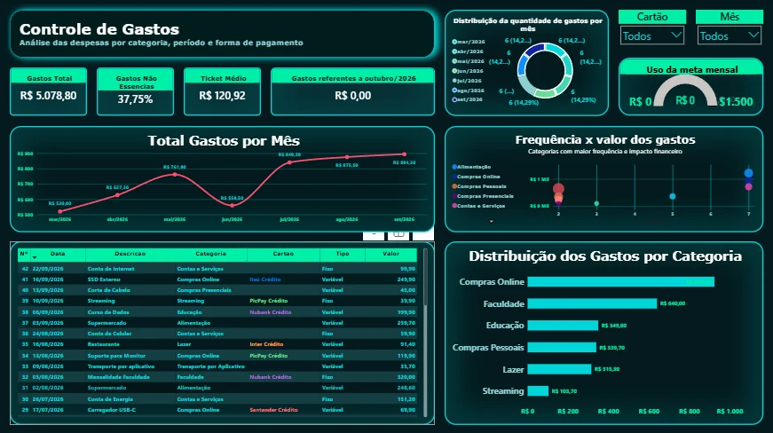
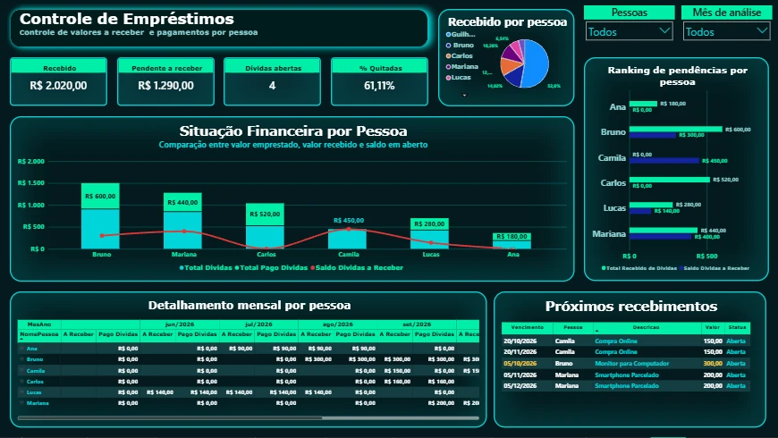
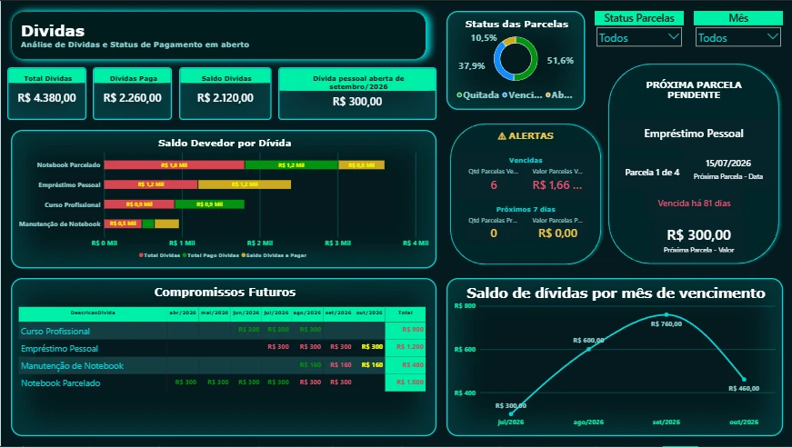
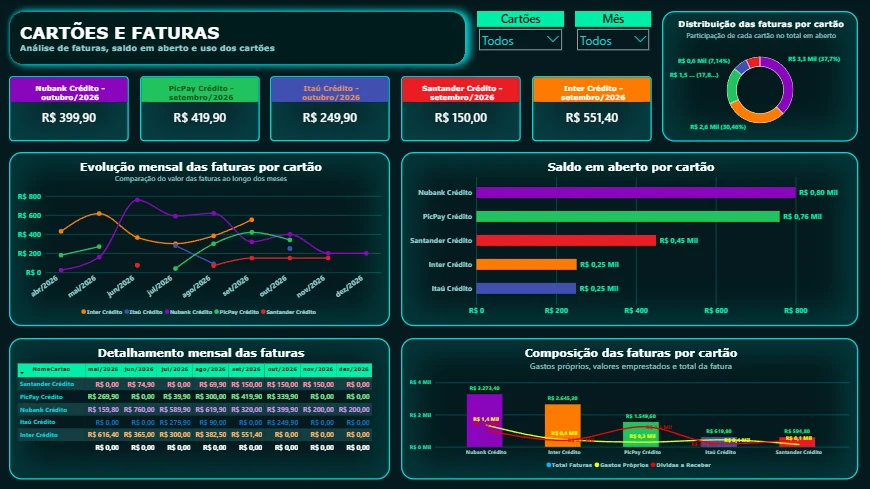
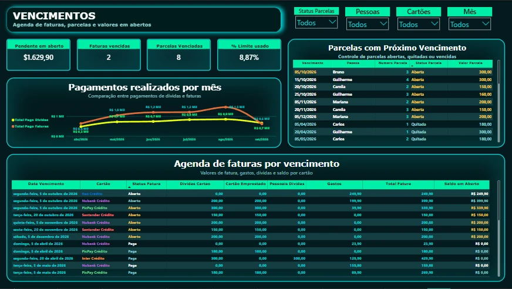
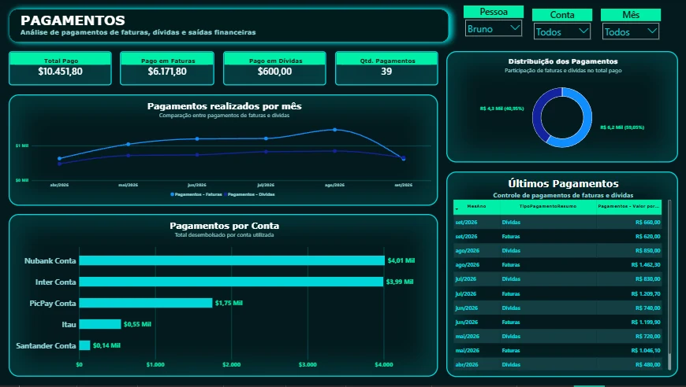
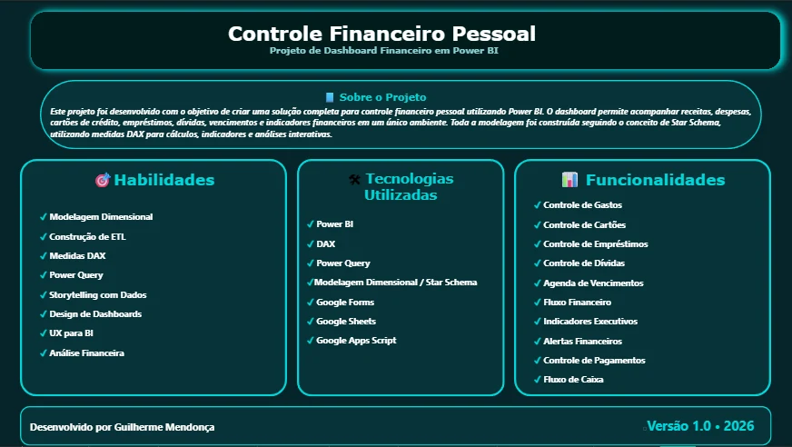

# Dashboard

## Visão Geral

O dashboard foi desenvolvido no Power BI para transformar os dados financeiros estruturados em informações visuais, indicadores e análises interativas.

A solução foi dividida em oito páginas:

1. Home;
2. Gastos;
3. Empréstimos;
4. Dívidas;
5. Cartões e Faturas;
6. Vencimentos;
7. Pagamentos;
8. Sobre o Projeto.

Cada página possui um objetivo específico e responde a um conjunto diferente de perguntas financeiras.

---

# 1. Home



## Objetivo

A página Home funciona como visão executiva do projeto.

Ela apresenta os principais indicadores financeiros em um único ambiente e permite identificar rapidamente:

- fluxo de caixa;
- receitas;
- despesas;
- valores a receber;
- valores a pagar;
- próximas faturas;
- compromissos financeiros;
- evolução mensal;
- principais categorias de gastos.

---

## Principais Indicadores

A página apresenta indicadores como:

- Fluxo de Caixa;
- Receitas;
- Despesas;
- A Receber;
- A Pagar;
- Faturas dos próximos 30 dias.

Esses indicadores fornecem uma visão resumida da situação financeira.

---

## Fluxo Financeiro Mensal

O gráfico de fluxo financeiro apresenta a evolução ao longo dos meses.

Entre as informações analisadas estão:

- total de entradas;
- saldo líquido;
- resultado financeiro acumulado.

Essa visualização permite comparar o comportamento das receitas e do saldo financeiro durante o período.

---

## Top Categorias de Gastos

O ranking de categorias permite identificar quais grupos possuem maior impacto nas despesas.

Exemplos:

- Compras Online;
- Faculdade;
- Educação;
- Compras Pessoais;
- Lazer.

Essa análise ajuda a identificar concentração de gastos.

---

## Compromissos Financeiros

O quadro de compromissos apresenta informações futuras, como:

- próxima fatura;
- próxima parcela;
- valores a pagar nos próximos 30 dias;
- valores a receber nos próximos 30 dias;
- saldo dos próximos 30 dias.

---

## Regra de Negócio Relacionada

A Home combina indicadores de:

```text
Movimento Financeiro
+
Posição Financeira
+
Compromissos Futuros
```

Por isso, algumas medidas possuem comportamento independente de filtros temporais.

---

## Como Apresentar esta Página

Uma forma simples de explicar a Home é:

> "A Home funciona como uma visão executiva do projeto. Eu concentrei aqui os principais indicadores de receitas, despesas, valores a pagar, valores a receber e fluxo de caixa. Além da posição atual, também mostro compromissos futuros, como próximas faturas e parcelas."

---

# 2. Gastos



## Objetivo

A página Gastos foi desenvolvida para detalhar o comportamento das despesas.

Ela permite analisar:

- valor total gasto;
- ticket médio;
- gastos não essenciais;
- gastos no cartão;
- evolução mensal;
- frequência das categorias;
- distribuição dos gastos.

---

## Indicadores Principais

Entre os indicadores estão:

- Gastos Total;
- Gastos Não Essenciais;
- Ticket Médio;
- Gastos referentes ao período analisado;
- percentual de utilização da meta mensal.

---

## Total de Gastos por Mês

O gráfico mensal permite acompanhar a evolução das despesas ao longo do tempo.

Essa visualização ajuda a identificar:

- aumento de gastos;
- redução de gastos;
- meses com maior concentração de despesas.

---

## Frequência x Valor dos Gastos

Essa análise combina duas perspectivas:

```text
Quantidade de ocorrências
x
Impacto financeiro
```

Uma categoria pode possuir muitas ocorrências com valores baixos ou poucas ocorrências com valores altos.

Essa diferença ajuda a interpretar melhor o comportamento financeiro.

---

## Distribuição dos Gastos por Categoria

O gráfico de categorias mostra quais áreas representam maior parcela dos gastos.

Isso facilita a identificação de padrões de consumo.

---

## Tabela de Gastos

A tabela detalhada apresenta informações como:

- data;
- descrição;
- categoria;
- cartão;
- tipo;
- valor.

Ela permite sair da visão agregada e analisar cada registro individual.

---

## Filtros

A página permite segmentação por:

- cartão;
- mês.

Os filtros permitem analisar o comportamento dos gastos em diferentes contextos.

---

## Regra de Negócio Relacionada

O projeto diferencia gastos realizados diretamente de gastos realizados no cartão.

Essa separação é importante principalmente para o cálculo do fluxo de caixa.

Uma compra no cartão representa uma despesa, mas não necessariamente uma saída imediata de dinheiro.

---

## Como Apresentar esta Página

> "Na página de Gastos eu consigo analisar tanto o valor financeiro quanto o comportamento das despesas. Além do total e ticket médio, criei uma análise de frequência por categoria para diferenciar categorias recorrentes de categorias que geram maior impacto financeiro."

---

# 3. Empréstimos



## Objetivo

A página Empréstimos controla valores relacionados principalmente a:

```text
A Receber
```

Ela representa situações em que outras pessoas possuem valores pendentes com o titular.

---

## Indicadores Principais

A página apresenta:

- valor recebido;
- valor pendente a receber;
- quantidade de dívidas abertas;
- percentual de parcelas quitadas.

---

## Recebido por Pessoa

O gráfico apresenta a distribuição dos valores já recebidos entre as pessoas cadastradas.

Isso permite identificar quem já realizou pagamentos e qual participação possui no total recebido.

---

## Situação Financeira por Pessoa

Esse visual compara:

- valor total da dívida;
- valor já recebido;
- saldo ainda pendente.

A análise permite enxergar a situação individual de cada pessoa.

---

## Ranking de Pendências

O ranking destaca pessoas com valores ainda pendentes.

Isso facilita identificar quais recebimentos possuem maior impacto financeiro.

---

## Detalhamento Mensal

A matriz apresenta a evolução dos valores por pessoa e período.

Entre as informações estão:

- valores a receber;
- pagamentos realizados;
- evolução mensal.

---

## Próximos Recebimentos

A tabela apresenta parcelas futuras relacionadas aos valores a receber.

Entre os campos estão:

- vencimento;
- pessoa;
- descrição;
- valor;
- status.

---

## Filtros

A página possui filtros de:

- pessoa;
- mês de análise.

O filtro de pessoa permite analisar individualmente cada relacionamento financeiro.

---

## Regra de Negócio Relacionada

O principal conceito dessa página é:

```text
Cartão emprestado
≠
Dívida própria
```

Quando outra pessoa utiliza o cartão do titular, o valor aparece na fatura do cartão, mas gera também uma obrigação dessa pessoa com o titular.

Por isso, o projeto registra esse valor como:

```text
A Receber
```

---

## Como Apresentar esta Página

> "Essa página surgiu por causa de uma regra de negócio específica: quando eu utilizo meu cartão para outra pessoa, o valor entra na minha fatura, mas não é uma dívida pessoal minha. Então eu crio uma obrigação separada como A Receber e acompanho os pagamentos dessa pessoa."

---

# 4. Dívidas



## Objetivo

A página Dívidas concentra as obrigações financeiras classificadas principalmente como:

```text
A Pagar
```

Ela permite acompanhar:

- valor total das dívidas;
- valor já pago;
- saldo restante;
- parcelas;
- vencimentos;
- compromissos futuros.

---

## Indicadores Principais

Entre os indicadores estão:

- Total Dívidas;
- Dívidas Pagas;
- Saldo Dívidas;
- dívida pessoal relacionada ao período analisado.

---

## Saldo Devedor por Dívida

Esse gráfico compara o valor original da dívida com:

- valor pago;
- saldo ainda pendente.

Isso permite analisar rapidamente quais obrigações ainda possuem maior saldo.

---

## Status das Parcelas

O gráfico apresenta a participação das parcelas em diferentes situações.

Exemplos:

- Quitada;
- Vencida;
- Aberta.

---

## Alertas

O quadro de alertas destaca:

- quantidade de parcelas vencidas;
- valor vencido;
- parcelas próximas do vencimento.

Essa área ajuda a transformar o dashboard em ferramenta de acompanhamento e não apenas análise histórica.

---

## Próxima Parcela Pendente

O indicador apresenta a próxima obrigação relevante.

Entre as informações estão:

- dívida;
- número da parcela;
- data;
- prazo;
- valor.

---

## Compromissos Futuros

A matriz apresenta os valores previstos para os próximos meses por dívida.

Essa visualização permite visualizar a distribuição das obrigações ao longo do tempo.

---

## Saldo por Mês de Vencimento

O gráfico mostra quanto das dívidas está concentrado em cada período futuro.

---

## Regra de Negócio Relacionada

O projeto separa:

```text
Dívida
↓
Parcela
↓
Pagamento
```

A dívida representa o compromisso completo.

A parcela representa o vencimento.

O pagamento representa o evento financeiro de quitação.

---

## Como Apresentar esta Página

> "Eu separei dívida, parcela e pagamento porque são eventos diferentes. A dívida representa o compromisso completo, a parcela controla cada vencimento e o pagamento registra quando o dinheiro realmente saiu. Isso permite trabalhar com pagamentos parciais, vencimentos diferentes e saldo restante."

---

# 5. Cartões e Faturas



## Objetivo

A página Cartões e Faturas permite analisar a utilização dos cartões e a composição das faturas.

---

## Indicadores por Cartão

Os cartões exibem o valor da próxima ou atual obrigação relevante.

Isso permite visualizar rapidamente a posição de cada cartão.

---

## Distribuição das Faturas por Cartão

O gráfico mostra quanto cada cartão representa no saldo total das faturas.

---

## Evolução Mensal das Faturas

A linha temporal permite comparar o comportamento das faturas dos diferentes cartões ao longo dos meses.

---

## Saldo em Aberto por Cartão

Esse gráfico destaca quanto ainda existe pendente em cada cartão.

---

## Detalhamento Mensal das Faturas

A matriz permite comparar os valores das faturas por cartão e mês.

---

## Composição das Faturas

Uma das principais características do projeto é a decomposição da fatura.

Conceitualmente:

```text
Fatura
├── Gastos Próprios
├── Valores de Cartão Emprestado
├── Dívidas Pessoais
└── Outros Componentes
```

Isso permite interpretar melhor o valor total da fatura.

---

## Filtros

A página possui filtros de:

- cartão;
- mês.

---

## Regra de Negócio Relacionada

O valor total da fatura não representa necessariamente apenas consumo próprio.

Exemplo:

```text
Fatura = R$ 600

R$ 300 → gasto próprio
R$ 200 → cartão emprestado
R$ 100 → dívida pessoal
```

Essa decomposição permite analisar qual parte realmente pertence ao titular.

---

## Como Apresentar esta Página

> "Na página de cartões eu não quis mostrar apenas o valor total da fatura. Eu separei sua composição porque uma fatura pode misturar gastos próprios, dívidas pessoais e compras realizadas para terceiros."

---

# 6. Vencimentos



## Objetivo

A página Vencimentos funciona como uma agenda financeira.

Ela foi desenvolvida para responder:

```text
O que está vencido?
O que vence em breve?
Quanto ainda está pendente?
```

---

## Indicadores Principais

A página apresenta:

- Pendente em Aberto;
- Faturas Vencidas;
- Parcelas Vencidas;
- percentual estimado de limite utilizado.

---

## Pagamentos Realizados por Mês

O gráfico compara:

- pagamentos de dívidas;
- pagamentos de faturas.

Isso permite analisar o comportamento dos desembolsos ao longo do tempo.

---

## Parcelas com Próximo Vencimento

A tabela apresenta:

- vencimento;
- pessoa;
- número da parcela;
- status;
- valor.

Ela funciona como uma agenda de compromissos relacionados às parcelas.

---

## Agenda de Faturas por Vencimento

A tabela detalha as faturas com informações como:

- data de vencimento;
- cartão;
- status;
- dívidas no cartão;
- cartão emprestado;
- dívidas pessoais;
- gastos;
- total da fatura;
- saldo em aberto.

---

## Prevenção de Dupla Contagem

Essa página utiliza uma das principais regras de negócio do projeto.

Quando uma parcela já está incorporada a uma fatura, ela não deve ser somada novamente como compromisso separado.

Conceitualmente:

```text
Total Vencido
=
Faturas Vencidas
+
Parcelas Vencidas Fora de Fatura
```

---

## Filtros

A página possui filtros de:

- status das parcelas;
- pessoa;
- cartão;
- mês.

---

## Posição x Período

Alguns indicadores representam posição financeira atual.

Por isso, determinados filtros temporais não afetam todos os cards.

Essa configuração foi feita intencionalmente para preservar o significado dos indicadores.

---

## Como Apresentar esta Página

> "Essa página funciona como uma agenda financeira. Um dos maiores cuidados foi evitar dupla contagem, porque uma parcela pode já estar dentro de uma fatura. Então, nos indicadores de vencimento, eu somo a fatura e apenas parcelas que estão fora de fatura."

---

# 7. Pagamentos



## Objetivo

A página Pagamentos analisa os eventos financeiros efetivamente realizados.

Ela diferencia principalmente:

- pagamento de faturas;
- pagamento de dívidas.

---

## Indicadores Principais

A página apresenta:

- Total Pago;
- Pago em Faturas;
- Pago em Dívidas;
- Quantidade de Pagamentos.

---

## Pagamentos Realizados por Mês

O gráfico permite comparar os desembolsos relacionados a:

- faturas;
- dívidas.

Essa visão utiliza a data real do pagamento.

---

## Distribuição dos Pagamentos

O gráfico de distribuição mostra a participação de faturas e dívidas no total desembolsado.

---

## Pagamentos por Conta

O gráfico apresenta em quais contas ocorreu maior volume de pagamentos.

Isso permite analisar a origem financeira dos desembolsos.

---

## Últimos Pagamentos

A tabela apresenta o histórico dos pagamentos por:

- mês;
- tipo;
- valor.

---

## Filtros

A página possui filtros de:

- pessoa;
- conta;
- mês.

---

## Regra do Filtro Pessoa

O filtro de pessoa foi configurado para atuar principalmente sobre os pagamentos relacionados a dívidas.

Isso acontece porque uma fatura pertence ao titular do cartão e pode conter valores de diversas origens.

Aplicar diretamente o filtro de pessoa sobre todos os pagamentos poderia produzir uma interpretação incorreta.

---

## Data de Pagamento

As análises desta página utilizam a data em que o pagamento realmente ocorreu.

Para isso, medidas DAX utilizam relacionamentos específicos com a dimensão calendário por meio de:

```DAX
USERELATIONSHIP()
```

---

## Como Apresentar esta Página

> "Aqui eu analiso o caixa efetivamente movimentado. Diferente da página de dívidas, que mostra obrigações, essa página trabalha com o evento de pagamento e utiliza a data real em que o dinheiro saiu."

---

# 8. Sobre o Projeto



## Objetivo

A página Sobre apresenta uma síntese do projeto e das competências aplicadas durante seu desenvolvimento.

---

## Habilidades

Entre as habilidades aplicadas estão:

- Modelagem Dimensional;
- Construção de ETL;
- Medidas DAX;
- Power Query;
- Storytelling com Dados;
- Design de Dashboards;
- UX para BI;
- Análise Financeira.

---

## Tecnologias Utilizadas

A solução utiliza:

- Power BI;
- DAX;
- Power Query;
- Modelagem Dimensional / Star Schema;
- Google Forms;
- Google Sheets;
- Google Apps Script.

---

## Funcionalidades

Entre as principais funcionalidades estão:

- Controle de Gastos;
- Controle de Cartões;
- Controle de Empréstimos;
- Controle de Dívidas;
- Agenda de Vencimentos;
- Fluxo Financeiro;
- Indicadores Executivos;
- Alertas Financeiros;
- Controle de Pagamentos;
- Fluxo de Caixa.

---

# Navegação do Dashboard

A estrutura do relatório segue a seguinte sequência:

```text
Home
  ↓
Gastos
  ↓
Empréstimos
  ↓
Dívidas
  ↓
Cartões e Faturas
  ↓
Vencimentos
  ↓
Pagamentos
  ↓
Sobre
```

Essa organização permite começar pela visão executiva e avançar gradualmente para análises mais detalhadas.

---

# Decisões de UX e Design

O dashboard utiliza uma identidade visual escura com elementos em destaque.

Entre as decisões adotadas estão:

- padronização visual entre páginas;
- títulos claros;
- indicadores na parte superior;
- uso de cores para diferenciação de status;
- agrupamento de informações relacionadas;
- filtros posicionados de forma consistente;
- redução de elementos visuais desnecessários;
- destaque para alertas e compromissos futuros.

---

# Interações entre Visuais

As interações entre gráficos e filtros foram revisadas individualmente.

Nem todos os visuais devem responder a todos os filtros.

Exemplo:

```text
Filtro de mês
→ deve afetar análises históricas

Filtro de mês
→ pode não afetar indicadores de posição atual
```

Essa configuração evita interpretações incorretas.

---

# Princípio de Storytelling

As páginas foram estruturadas para responder perguntas progressivamente.

## Home

```text
Como está minha situação financeira?
```

## Gastos

```text
Onde estou gastando?
```

## Empréstimos

```text
Quem ainda precisa me pagar?
```

## Dívidas

```text
Quanto eu ainda devo?
```

## Cartões

```text
Como estão minhas faturas?
```

## Vencimentos

```text
O que vence ou está atrasado?
```

## Pagamentos

```text
Quanto dinheiro realmente saiu?
```

Essa sequência transforma o dashboard em uma narrativa financeira e não apenas em um conjunto de gráficos.

---

# Roteiro Resumido para Apresentação

Uma apresentação rápida do projeto pode seguir esta sequência:

```text
1. Apresentar o problema
2. Explicar rapidamente a arquitetura
3. Mostrar a Home
4. Demonstrar Gastos
5. Explicar A Receber / cartão emprestado
6. Explicar Dívidas
7. Mostrar composição das faturas
8. Mostrar agenda de vencimentos
9. Mostrar pagamentos
10. Explicar modelagem e DAX
```

---

# Exemplo de Introdução em uma Apresentação

> "Esse projeto surgiu da necessidade de centralizar diferentes tipos de movimentações financeiras que antes eram difíceis de analisar em conjunto. Eu criei uma solução integrada utilizando Google Forms, Google Sheets, Apps Script e Power BI. Os dados passam por uma camada operacional, são organizados em um modelo dimensional e depois consumidos pelo dashboard."

---

# Exemplo de Destaque Técnico

Durante a apresentação, um dos pontos técnicos que podem ser destacados é:

> "O principal desafio não foi criar os gráficos, mas representar corretamente as regras financeiras. Eu precisei diferenciar gasto, dívida, parcela, fatura e pagamento, além de evitar dupla contagem quando uma parcela já estava incorporada a uma fatura."

---

# Exemplo de Encerramento

> "O resultado foi um dashboard que não mostra apenas quanto foi gasto, mas acompanha posição financeira, fluxo de caixa, valores a pagar, valores a receber, vencimentos e pagamentos. O projeto também me permitiu aplicar modelagem dimensional, DAX, automação e conceitos de engenharia de dados em uma solução completa."

---

# Resultado

O dashboard funciona como a camada final de consumo da arquitetura.

Ele transforma os dados processados pelo sistema em informações que permitem acompanhar:

- comportamento financeiro;
- histórico;
- posição atual;
- compromissos futuros;
- recebimentos;
- pagamentos;
- dívidas;
- utilização de cartões.

O objetivo foi transformar dados financeiros operacionais em informação estruturada para tomada de decisão.
